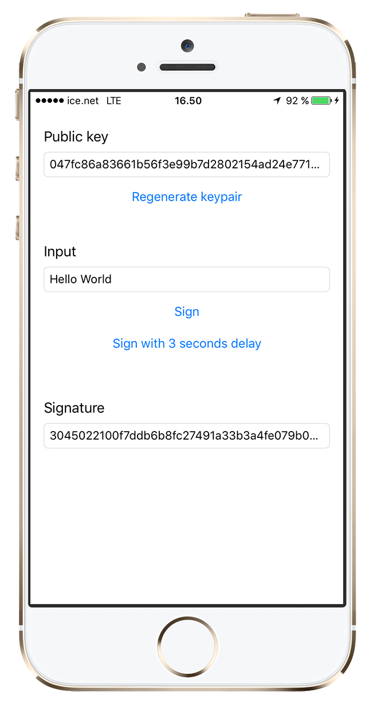

SecureEnclaveCrypto
===================



This project shows you how to
- create a keypair where as the private key is stored in the secure enclave
- sign a string / some data with the private key
- use the security functions like SecKeyRawVerify, SecKeyGeneratePair and SecItemCopyMatching in Swift 3 and Objective-C
- store the public key in the keychain

Apple quietly released a new API in iOS 9 (`kSecAttrTokenIDSecureEnclave`) that allowed developers to create and use keys stored directly in the Secure Enclave (see "[Security and Your Apps](https://developer.apple.com/videos/play/wwdc2015/706/)" starting from slide 195). This feature opens enormous possibilities for security by enabling applications to use private keys that are safely stored outside of iOS and away from any potential malware.

We tried to use this API shortly after it was released and found it lacking: the required attribute was entirely undocumented, the key format is not compatible with OpenSSL, and Apple didn't even say what cipher suite was used (it's [secp256r1](https://www.ietf.org/rfc/rfc5480.txt)). The code in this repository is an attempt to fix these issues by providing an easy-to-use wrapper around the Secure Enclave Crypto API.

## Show me the code

This project thus contains two codebases, one in [Swift](SecureEnclaveSwift) (from [@hfossli](https://github.com/hfossli)) and one in [Objective-C](SecureEnclaveObjective-C) which show how to use this API for basic functionality. Both directories contain a `README.md` file with more specific documentation.


## Creating OpenSSL-compatible public key
The public key returned from the Secure Enclave can be fed to `key_builder.rb` to create an OpenSSL-compatible representation of the ECC public key. The `key_builder.rb` script takes one parameter: the public key as hex / base 16.

```bash
$ ruby key_builder.rb "045ac9bd 7c4d8e77 b37fd14f bf2822ac 4ad4d62f 1bce4019 60bdbdc7 1102da0c 78603266 7dd0fe8b 2a847135 1d1d0e01 a2cd019e ab9c4b7c 9a3fed15 1f20bcc2 9a"

-----BEGIN PUBLIC KEY-----
MFkwEwYHKoZIzj0CAQYIKoZIzj0DAQcDQgAEsng2kkyuVVqyK1BRo8EZhJTM
Mubz1P4MvF6TVwmnbCEUGv4IssA8FXqNb2txbLtlYvNiJPjss/62HKMvR2tm
uA==
-----END PUBLIC KEY-----
```
