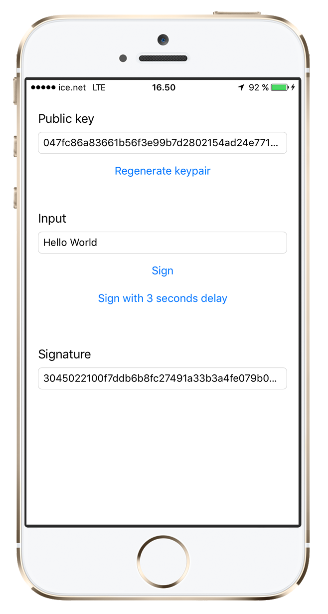

Secure Enclave Helper
=====================



This demo won't run on a simulator (Secure Enclave is obviously needed).

If you want to test how this behaves while the app is in background you can use the "Sign with delay" button and hit the home button. While generating the key pair you may set different access levels like:
```
let access = kSecAttrAccessibleWhenPasscodeSetThisDeviceOnly
let control = try helper.accessControl(with: access)
let keypair = try helper.generateKeyPair(accessControl: control)
```

## SecureEnclaveHelper.swift

This is a stateless class whose main functions are
- generate key pair
- save the public key in keychain
- save the private key in secure enclave
- retreive key pair
- sign a message
- verify a signature
- delete key pair

By design business logic for what do to if keys are missing etc is not part of this class. That level of logic should be handled by the app or a manager on the outside. See `ViewController.swift` and `SecureEnclaveManager.swift` for ideas on this topic.

You may either embed this directly in your project or use it as a guidance for how to use the Security API in Swift 3.
